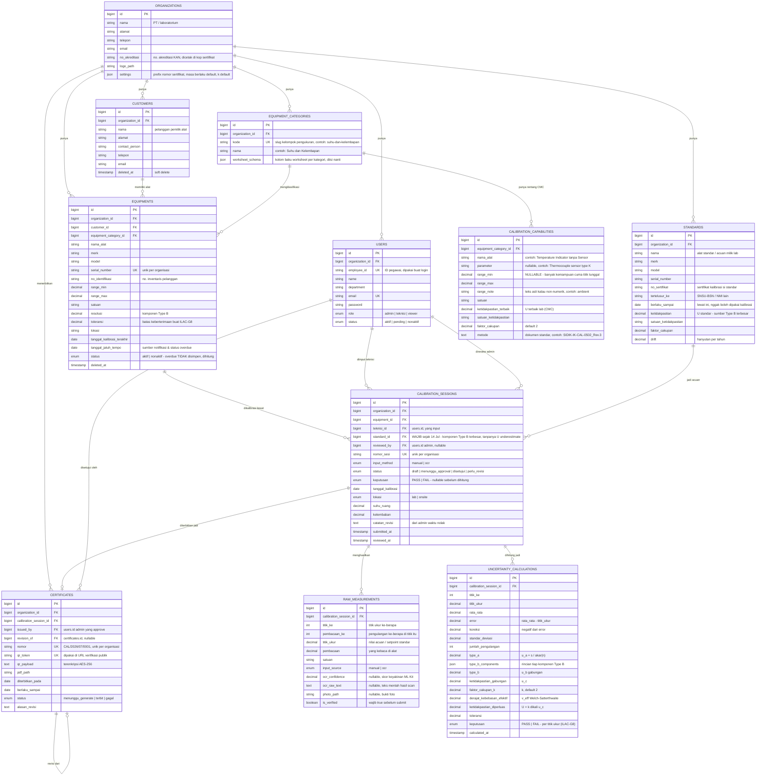
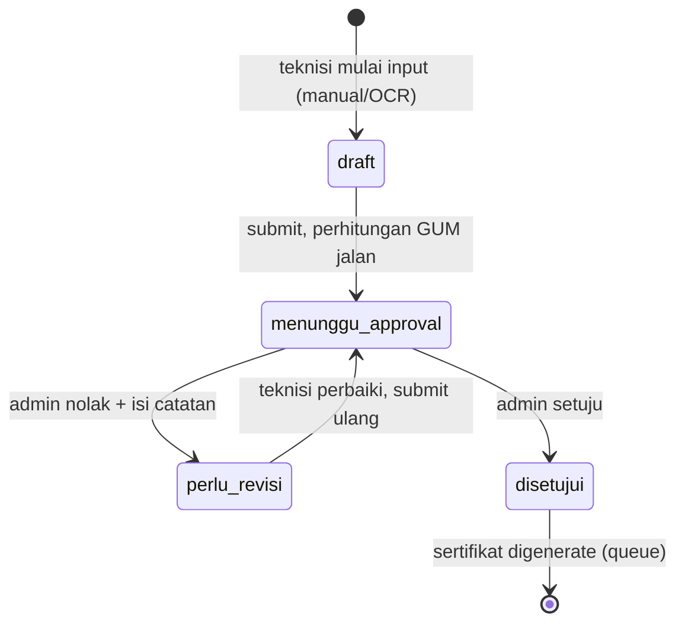

# ERD — Skema Database ASMO

🏠 [[Dashboard]] · Dirancang [[2026-07-14]], **dieksekusi jadi migration di hari yang sama** · PIC Backend: **Raihan**

Skema untuk pipeline kalibrasi: **alat → sesi kalibrasi → data mentah → perhitungan ketidakpastian → sertifikat**. Dokumen ini **sudah disamain dengan migration yang beneran jalan** — kalau beda, migration yang bener.

> **Nama kolom & nilai enum ngikutin `docs/kontrak-api.md` (repo mobile), bukan istilah Inggris di draft awal.** Alasannya: mobile ngoding persis string itu (`status: "menunggu_approval"`, `keputusan: "PASS"`). Kalau backend pakai istilah sendiri, tiap response harus diterjemahin dulu — dan penerjemahan itu tempat bug diam-diam lahir.

Aturan yang dipegang: [[Aturan Bisnis Inti]]. Batas rentang & ketidakpastian: [[Data Kemampuan Kalibrasi]].

## Diagram ERD

## Alur Status Sesi Kalibrasi

`keputusan` (PASS/FAIL) **terpisah** dari `status`. Sesi FAIL tetap bisa `disetujui` dan terbit sertifikat — isinya aja beda. Jangan diblokir di backend (lihat [[Aturan Bisnis Inti]]).

## Keputusan Desain (& kenapa)

**1. `raw_measurements` = satu baris per pembacaan, bukan JSON array per titik.**
Type A butuh standar deviasi dari tiap pengulangan, dan tiap angka hasil OCR bawa `ocr_confidence` + foto sendiri. Kalau ditumpuk jadi JSON, dua-duanya nggak bisa diaudit ("angka mana yang OCR-nya ragu?").

**2. Komponen Type B disimpan sebagai JSON di `uncertainty_calculations.type_b_components`.**
Bentuknya `[{source, value, distribution, divisor, sensitivity, u_i}]` — sumbernya: ketidakpastian standar, resolusi alat, drift, kondisi lingkungan. JSON karena jumlah komponennya beda-beda per kategori alat. Kalau nanti perlu laporan "kontribusi resolusi vs standar", pecah jadi tabel `uncertainty_components`.

**3. Hasil hitung DISIMPAN, bukan dihitung ulang tiap dibaca.**
Sertifikat yang terbit 5 tahun lalu harus tetap nunjukin angka yang sama walau rumus/konstantanya udah berubah.

**4. `status: overdue` di alat SENGAJA nggak disimpen di DB.**
Dia turunan dari `tanggal_jatuh_tempo`. Kalau disimpen, nilainya basi tiap ganti hari dan butuh cron buat nyegerin. Di DB cuma ada `aktif`/`nonaktif`; `overdue` dihitung waktu dibaca. Mobile tetap nerima 3 nilai persis kayak di kontrak.

**5. `organization_id` ikut ditempel di tabel anak (`equipments`, `calibration_sessions`, `certificates`).**
Sedikit denormalisasi, tapi scoping multi-tenant jadi satu `where` — nggak perlu join berantai cuma buat mastiin data nggak bocor antar-PT.

**6. `certificates.qr_token` (acak), bukan `id`, yang dipakai di URL verifikasi publik.**
Endpoint verifikasi QR itu tanpa login. Kalau pakai `id` berurutan, orang bisa nebak-nebak sertifikat lain.

**7. Soft delete di master data; data kalibrasi & sertifikat nggak boleh dihapus.**
Retensi audit 5 tahun. Alat yang "dihapus" harus tetap bisa ditelusuri dari sertifikat lama.

**8. `calibration_capabilities.range_min` nullable + ada `range_note`.**
Dari 151 rentang di lampiran akreditasi, **59 nggak punya batas bawah numerik**: ada yang kemampuan titik tunggal (buret "25 mL"), ada yang batasnya kata-kata (oven "ambient ~ 300 °C"). Teks aslinya disimpen di `range_note` biar nggak ilang.

## Jebakan yang Udah Kena (jangan diulang)

**Nama tabel `equipments` berantem sama inflector Laravel.** Laravel nganggep "equipment" itu uncountable, jadi:
- Model `Equipment` nyari tabel `equipment` (tanpa `s`) → **wajib** `protected $table = 'equipments';`
- `$table->foreignId('equipment_id')->constrained()` juga nebak tabel `equipment` → **wajib** `constrained('equipments')`

Yang kedua ini bikin migration gagal total waktu pertama dijalanin (`Failed to open the referenced table 'equipment'`).

## Urutan Migration

`organizations` → `users` (alter) → `customers` → `equipment_categories` → `calibration_capabilities` → `standards` → `equipments` → `calibration_sessions` → `raw_measurements` → `uncertainty_calculations` → `certificates` → FK `users.organization_id`.

FK dari `users` ke `organizations` sengaja ditaruh paling akhir: kolomnya udah kebikin duluan waktu bikin auth (sebelum tabel `organizations` ada).

## Seeder

`php artisan migrate:fresh --seed` ngisi:
- **1 organisasi** — PT Sidik (dari lampiran akreditasi)
- **10 kategori + 151 kemampuan kalibrasi** — diimpor dari `data-kemampuan-kalibrasi.json`
- **4 akun**: `ASM-0001` admin · `ASM-0002` teknisi · `ASM-0003` viewer · `ASM-0099` sengaja `pending` (buat nyoba layar "belum disetujui"). Password semua `rahasia123`
- **2 pelanggan + 5 alat + 1 standar** — 2 di antaranya sengaja lewat jatuh tempo, biar status `overdue` & angka dashboard kebukti jalan

**9. `standard_id` awalnya dirancang nullable, diubah jadi WAJIB 14 Jul.**
Draft awal (poin di atas) sempat bikin `standard_id` opsional. Ternyata tanpa Standar Acuan, ketidakpastian standar (komponen Type B terbesar) hilang dari perhitungan GUM — `ketidakpastian_diperluas` (U) jadi lebih kecil dari yang sebenarnya, dan alat yang harusnya FAIL bisa lolos jadi PASS palsu. Lihat `docs/kontrak-api.md` §4 buat detail lengkapnya. Backend sekarang nolak `422` kalau `POST/PUT /api/calibrations` nggak sertakan `standard_id`.

## Yang Belum Masuk ERD Ini

- `notifications` (Minggu 09) — rencananya pakai tabel bawaan Laravel + scheduled job yang nyisir `equipments.tanggal_jatuh_tempo`
- `certificate_templates` (Minggu 08) — template sertifikat yang bisa dikustom admin
