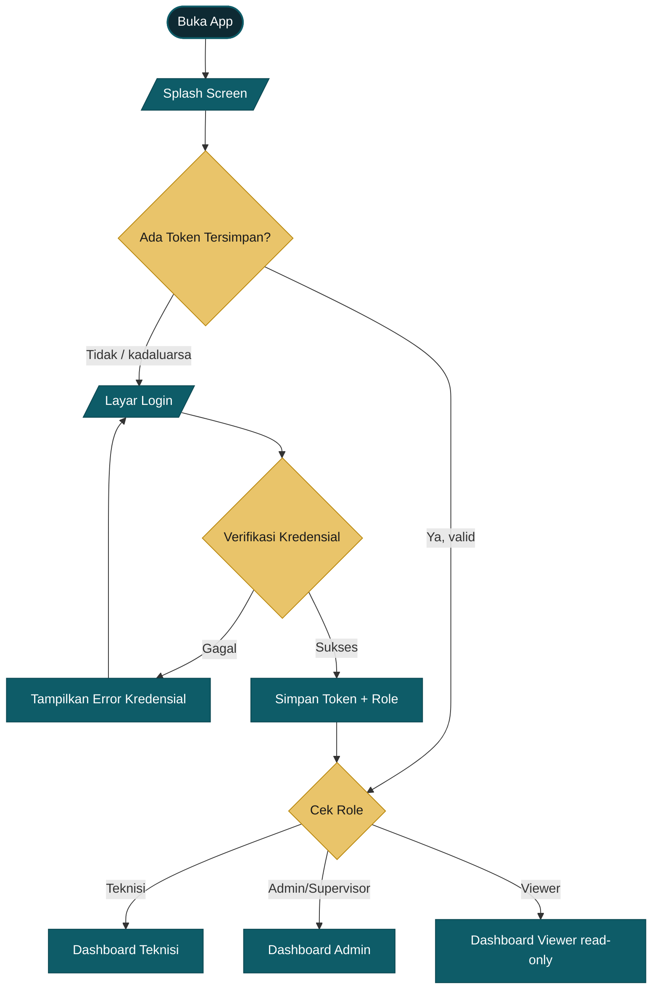
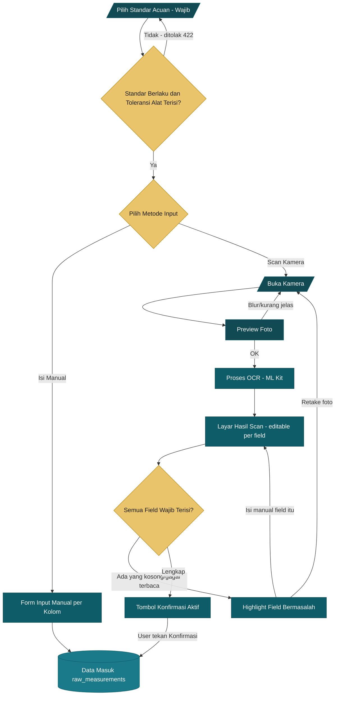
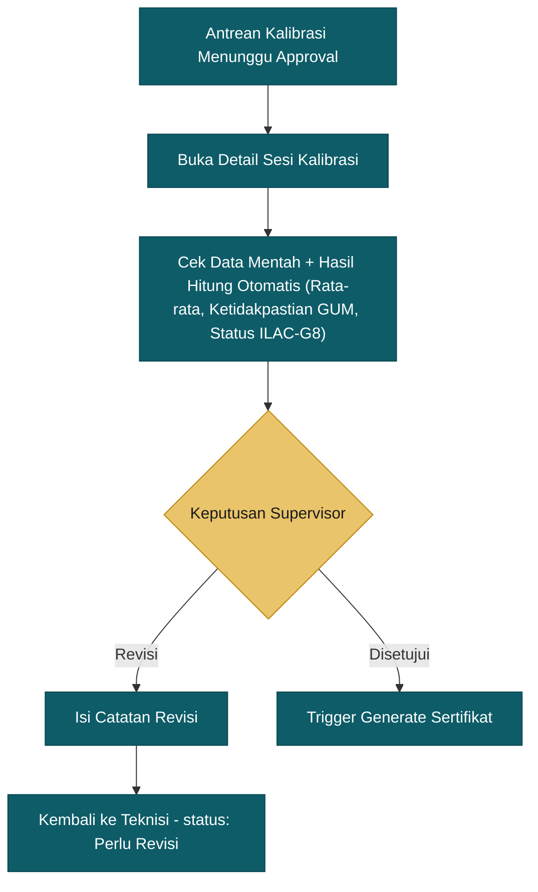
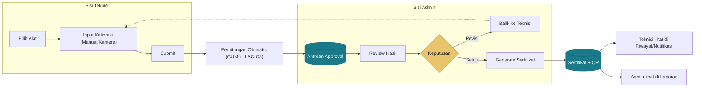

# Alur Aplikasi Lengkap — Flow Teknisi (User) & Admin

🏠 [[Dashboard]] · Dokumen ini merangkum & mendetailkan ulang isi dari `README-asmo-mobile.md`, `01 - Ringkasan Project.md`, `01-Rencana-Pengembangan-Ringkas.md`, `03-Addendum-Fitur-Kamera-OCR.md`, dan dua file mermaid (`Flowchart-Alur-Utama-Lengkap.mermaid`, `Flowchart-Alur-Inti-Ringkas.mermaid`) jadi satu peta alur utuh — biar nggak perlu buka-buka banyak file cuma buat lihat "urutan layar-nya gimana sih".

> Satu APK, satu codebase Flutter. Admin dan Teknisi pakai app yang **sama persis** — yang beda cuma isi menu & hak akses, dikontrol lewat role. Nggak ada web admin panel terpisah.

---

## 1. Ringkasan Role

| Role | Siapa | Inti tugas di app |
|---|---|---|
| **Teknisi** ("User" utama) | Petugas lapangan yang kalibrasi alat | Kelola alat, input hasil kalibrasi (manual/kamera), pantau status approval & sertifikat miliknya |
| **Admin / Supervisor QC** | Penanggung jawab QC | Semua hak Teknisi + approve/reject hasil kalibrasi, kelola master data, generate & kelola sertifikat, lihat laporan lintas-teknisi |
| **Viewer** | Pihak yang cuma perlu lihat (mis. manajemen non-QC) | Read-only: lihat data alat, riwayat, sertifikat — nggak bisa input/approve apa pun |

Navigasi **bottom nav sama untuk semua role**: `Dashboard / Alat / Riwayat / Notifikasi / Profil`. Yang beda cuma isi tab **Profil** — menu admin (Manajemen Pengguna, Master Data PT/Pelanggan, dst) **disembunyikan total** dari non-admin, bukan sekadar di-disable.

---

## 2. Alur Masuk (Sama untuk Semua Role)

**Layar Login/Splash — state wajib**: `loading` (cek token) → `normal` (form login) → `error kredensial` (username/password salah, ditampilkan jelas per field atau general) → `sukses` (redirect otomatis sesuai role).

---

## 3. FLOW TEKNISI (User Utama)

Ini alur harian yang paling sering dipakai — dari buka alat sampai sertifikat jadi.

### 3.1 Dashboard Teknisi
- State: `loading skeleton` → `empty` (belum ada alat/kalibrasi) → `normal` (ringkasan: alat yang jatuh tempo, kalibrasi draft belum submit, status approval terakhir)
- Aksi cepat dari dashboard: "Tambah Alat", "Mulai Kalibrasi Baru"

### 3.2 Data Alat
1. **Daftar Alat** — state `loading`, `empty`, `hasil pencarian kosong`. Bisa filter per kategori & status (aktif/overdue).
2. **Tambah/Edit Alat** — form dengan validasi per field (nama alat, kategori, nomor seri, tanggal kalibrasi terakhir, interval berikutnya, **toleransi**). State: `normal`, `error validasi per field`, `sukses simpan`. Field `toleransi` wajib diisi di sini — tanpa itu, alat nggak bisa dipakai kalibrasi sama sekali (PASS/FAIL nggak ada artinya tanpa batas keberterimaan).
3. Pilih alat → pilih **kategori kalibrasi** (Suhu, Massa, Volume, Tekanan, Panjang, dll — mengikuti struktur kelompok pengukuran di `data-kemampuan-kalibrasi.json` / `Rekap Data Kemampuan Kalibrasi`) → sistem menyiapkan **worksheet dengan kolom baku sesuai kategori**.
4. Pilih **Standar Acuan** (`GET /api/standards`, dropdown) — **wajib**, ini yang jadi rumus/komponen Type B terbesar di perhitungan ketidakpastian. Standar yang `masih_berlaku: false` tetap tampil di daftar (biar nggak dikira hilang) tapi ditolak `422` kalau dipilih. Tanpa `standard_id`, sesi kalibrasi nggak bisa disubmit.

### 3.3 Input Kalibrasi — Dua Jalur (Manual & Kamera/OCR)

Di entry point form, teknisi selalu punya **dua pilihan yang sama-sama tersedia** — kamera bukan pengganti, cuma mempercepat:

Detail penting (dari `03-Addendum-Fitur-Kamera-OCR.md`):
- Pilot kamera **cuma 3 kategori dulu** (mis. Panjang, Massa, Suhu — yang lembar kerjanya paling konsisten formatnya), bukan langsung semua 10 kelompok pengukuran
- **Tidak ada auto-submit** — tombol "Konfirmasi" wajib ditekan user setelah review
- Field wajib kosong/gagal terbaca → tombol "Konfirmasi & Lanjutkan" **disabled** sampai user melengkapi manual atau retake foto
- Setelah dikonfirmasi, data hasil scan masuk ke `raw_measurements` **lewat jalur yang sama persis** dengan input manual — nggak ada pipeline terpisah

- Layar Form Input Kalibrasi — state: `normal`, `error validasi`, `loading submit`, `sukses` (redirect ke status/pratinjau sertifikat)

### 3.4 Setelah Submit — Perhitungan Otomatis (Berjalan di Belakang Layar, di Backend)
Teknisi nggak ngoperasiin ini langsung, dan mobile **nggak menghitung apa pun** — cuma menampilkan hasil yang dibalikin backend. Tapi perlu tahu urutannya karena statusnya muncul di app:

1. Nilai rata-rata, error, dan sebaran pengulangan dihitung per titik ukur (minimal 2 pembacaan/titik)
2. Ketidakpastian metode **GUM**: Type A (dari sebaran pengulangan) + Type B (termasuk ketidakpastian Standar Acuan yang dipilih teknisi — komponen terbesar) → combined uncertainty `u_c` → dikali faktor cakupan k → expanded uncertainty (`U = k × u_c`)
3. Status **PASS/FAIL** ditentukan pakai *guarded acceptance* **ILAC-G8**: `PASS` kalau `|error| + U ≤ toleransi`, `FAIL` kalau tidak — bukan sekadar `|error| ≤ toleransi`. Satu titik ukur FAIL bikin seluruh sesi FAIL (FAIL tetap sah diterbitkan sertifikatnya, cuma beda status)
4. Masuk antrean **Approval Supervisor**

Kalau supervisor minta **revisi** → data balik ke form input (teknisi edit ulang), bukan alat baru dari nol.

### 3.5 Riwayat & Notifikasi (Teknisi)
- **Riwayat Kalibrasi** — cuma menampilkan riwayat kalibrasi yang jadi tanggung jawab/PIC teknisi tsb (admin lihat semua)
- **Notifikasi** — status approval (disetujui/revisi), alat yang mendekati jatuh tempo kalibrasi ulang
- **Detail Sertifikat** (kalau sudah disetujui & di-generate) — state: `loading generate PDF`, `sukses` (preview + unduh), `gagal` (tombol retry)

### 3.6 Profil (Teknisi)
Menu standar aja: data akun, ganti password, logout. **Tidak ada** menu Manajemen Pengguna atau Master Data PT/Pelanggan — bukan disembunyikan pakai disable, tapi memang nggak dirender sama sekali di role ini.

---

## 4. FLOW ADMIN / SUPERVISOR

Semua yang bisa dilakukan Teknisi, **plus** kendali penuh atas data master, approval, dan laporan.

### 4.1 Dashboard Admin
- State sama (`loading skeleton` / `empty` / `normal`), tapi ringkasannya **lintas-teknisi**: jumlah kalibrasi menunggu approval, alat overdue seluruh organisasi, sertifikat terbit bulan ini

### 4.2 Kelola Master Data
- Nama PT, Alamat, Data Pelanggan — CRUD penuh (Teknisi & Viewer nggak bisa akses ini)
- Data Standar Alat (alat referensi lab, bukan alat milik pelanggan)

### 4.3 Kelola Data Alat (Lintas Teknisi)
Sama seperti flow Teknisi di atas, tapi admin bisa lihat & edit data alat **milik semua teknisi**, bukan cuma miliknya sendiri.

### 4.4 Approval Kalibrasi — Inti Peran Admin

Catatan bisnis penting: **revisi tidak menimpa (overwrite)** data lama — kalau sudah pernah jadi sertifikat lalu direvisi, dibuat entry baru dengan `revision_of` merujuk ke sertifikat asal.

### 4.5 Generate & Kelola Sertifikat
Begitu disetujui, proses berjalan lewat **queue job** (bukan sinkron — biar UI nggak nge-freeze):
1. Nomor sertifikat otomatis, format `CAL/{tahun}/{bulan}/{4 digit}`, dijamin unik lewat **DB transaction locking**
2. Data pelanggan + alat + hasil kalibrasi ditarik otomatis dari relasi (nggak diketik ulang)
3. QR code dengan payload terenkripsi (AES-256) → bisa diverifikasi publik lewat endpoint `/api/verify/{qr_token}` tanpa perlu login
4. Admin bisa preview, unduh, atau retry kalau proses generate gagal

### 4.6 Laporan & Export
- Riwayat kalibrasi **semua teknisi** (bukan cuma milik sendiri)
- Rekap alat & rekap per teknisi
- Export PDF/Excel

### 4.7 Manajemen Pengguna
> Fitur ini masuk **Fase 3**, bukan bagian MVP awal — dicatat di sini biar alurnya kebayang utuh, tapi belum jadi target milestone-milestone pertama. Ada keputusan yang masih ngegantung soal migrasi field "teknisi teks bebas" → akun user penuh (R10), harus diputuskan dulu sebelum fase ini mulai dikerjakan.
- Tambah/nonaktifkan akun teknisi/admin/viewer, atur ulang role

### 4.8 Profil (Admin)
Sama seperti Teknisi + menu tambahan: **Manajemen Pengguna**, **Master Data PT/Pelanggan** — muncul cuma di tab Profil kalau role-nya admin.

---

## 5. Titik Temu Alur Teknisi ↔ Admin

Ini bagian yang paling sering bikin bingung kalau dilihat terpisah — jadi digambar jadi satu:

Prinsip yang harus tetap dipegang di kedua sisi (dari `01 - Ringkasan Project.md`):
- **Kamera mempercepat input, bukan menggantikan verifikasi** — selalu ada layar review manusia sebelum data final tersimpan
- **Input manual tetap fallback yang selalu berfungsi** — OCR nggak boleh jadi satu-satunya jalan
- **Revisi = entry baru, bukan overwrite** — jejak audit tetap utuh sesuai kebutuhan ISO 9001 / ISO/IEC 17025

---

## 6. FLOW VIEWER (Ringkas)

Role paling sederhana — akses read-only ke:
- Dashboard (ringkasan, tanpa aksi apa pun)
- Daftar Alat & detailnya
- Riwayat Kalibrasi & Detail Sertifikat (lihat + unduh PDF, nggak bisa input/approve)

Tidak ada tombol "Tambah", "Submit", atau "Approve" yang dirender sama sekali di role ini.

---

## 7. Tabel Ringkas Perbedaan Akses per Layar

| Layar / Aksi | Teknisi | Admin/Supervisor | Viewer |
|---|---|---|---|
| Lihat Dashboard | ✅ (data sendiri) | ✅ (lintas-teknisi) | ✅ (read-only) |
| Tambah/Edit Alat | ✅ | ✅ (semua alat) | ❌ |
| Input Kalibrasi (Manual/Kamera) | ✅ | ✅ | ❌ |
| Approve/Reject Kalibrasi | ❌ | ✅ | ❌ |
| Generate & Kelola Sertifikat | Lihat hasil saja | ✅ Kontrol penuh | Lihat saja |
| Kelola Master Data (PT/Alamat/Pelanggan) | ❌ | ✅ | ❌ |
| Laporan Lintas-teknisi | ❌ | ✅ | Lihat saja |
| Manajemen Pengguna *(Fase 3)* | ❌ | ✅ | ❌ |

---

## 8. Referensi Silang
- Detail milestone & tanggal per fase → [[01-Rencana-Pengembangan-Ringkas]] / `02-Rencana-Pengembangan-Detail.md`
- Detail pilot kamera/OCR per task → `03-Addendum-Fitur-Kamera-OCR.md`
- Batas rentang ukur & ketidakpastian per kategori alat (buat validasi input & worksheet dinamis) → [[Rekap-Data-Kemampuan-Kalibrasi]] / `data-kemampuan-kalibrasi.json`
- Diagram alur data mentah → sertifikat versi ringkas/lengkap asli → `Flowchart-Alur-Inti-Ringkas.mermaid`, `Flowchart-Alur-Utama-Lengkap.mermaid`
- Setup teknis & struktur folder aplikasi mobile → `README-asmo-mobile.md`
- Bentuk request/response API kalibrasi (`standard_id` wajib, rumus guarded acceptance, contoh JSON) → `docs/kontrak-api.md` §3–4 (repo mobile) dan [[Aturan Bisnis Inti]]

*Dokumen ini bisa langsung dipindah ke folder `04 - Referensi Teknis/` di vault Obsidian kamu — semua diagram mermaid di atas otomatis kerender kalau dibuka di Obsidian.*
