# Flowchart Alur Lengkap — Teknisi, Admin, Viewer

🏠 [[Dashboard]] · Versi `flowchart TD` gabungan dari [[Alur-Aplikasi-User-dan-Admin]] — mencakup login, tiga role (Teknisi/Admin/Viewer), pipeline OCR kamera, perhitungan otomatis GUM+ILAC-G8, sampai approval & generate sertifikat, dalam satu diagram.

```mermaid
flowchart TD
    Start([Mulai - Buka Aplikasi]) --> Splash[/Splash Screen/]
    Splash --> TokenCek{Token Tersimpan Valid?}
    TokenCek -->|Tidak| LoginForm[/Form Login/]
    LoginForm --> AuthCek{Verifikasi Kredensial}
    AuthCek -->|Gagal| LoginErr[Tampilkan Error Kredensial]
    LoginErr --> LoginForm
    AuthCek -->|Sukses| SimpanToken[Simpan Token + Role]
    TokenCek -->|Ya| RoleCek{Cek Role Pengguna}
    SimpanToken --> RoleCek

    RoleCek -->|Viewer| VDash[Dashboard Viewer]
    RoleCek -->|Teknisi| TDash[Dashboard Teknisi]
    RoleCek -->|Admin/Supervisor| ADash[Dashboard Admin]

    subgraph VIEWER[" VIEWER - Read Only "]
        VDash --> VAlat[Lihat Daftar Alat]
        VDash --> VRiwayat[Lihat Riwayat Kalibrasi]
        VDash --> VSertif[Lihat / Unduh Sertifikat]
    end

    subgraph TEKNISI[" TEKNISI - Input and Kelola Alat "]
        TDash --> TAlat[Daftar Alat]
        TAlat --> TTambah["Tambah/Edit Alat (toleransi wajib diisi)"]
        TAlat --> TKategori{Pilih Kategori Alat}
        TKategori --> TWorksheet[Worksheet Kolom Baku per Kategori]
        TWorksheet --> TStandar[/Pilih Standar Acuan - Wajib/]
        TStandar --> TPraSyarat{Standar Berlaku dan Toleransi Alat Terisi?}
        TPraSyarat -->|Tidak - ditolak 422| TStandar
        TPraSyarat -->|Ya| TMetode{Pilih Metode Input}
        TMetode -->|Manual| TManual[Isi Form Manual per Kolom]
        TMetode -->|Kamera| TKamera[/Buka Kamera/]
        TKamera --> TPreview[Preview Foto]
        TPreview -->|Blur/Kurang Jelas| TKamera
        TPreview -->|OK| TOCR[Proses OCR - ML Kit]
        TOCR --> THasil["Layar Hasil Scan (Editable per Field)"]
        THasil --> TValid{Field Wajib Lengkap?}
        TValid -->|Kosong/Gagal Terbaca| THighlight[Highlight Field Bermasalah]
        THighlight -->|Isi Manual| THasil
        THighlight -->|Retake Foto| TKamera
        TValid -->|Lengkap| TKonfirmasi[Tekan Tombol Konfirmasi]
        TManual --> TSimpan[(raw_measurements)]
        TKonfirmasi --> TSimpan
        TSimpan --> TSubmit[/Submit Kalibrasi/]
    end

    subgraph HITUNG[" PERHITUNGAN OTOMATIS - Backend, Mobile Cuma Nampilin "]
        Hitung["Rata-rata - Error - min. 2 Pembacaan per Titik"] --> Uncert["Ketidakpastian GUM: Type A + Type B (termasuk U Standar Acuan), U = k x u_c"]
        Uncert --> Status{"Keputusan ILAC-G8 (guarded acceptance): |error| + U <= toleransi ?"}
        Status -->|Ya, tiap titik| StatusPass[PASS]
        Status -->|Tidak, ada 1 titik saja| StatusFail["FAIL (1 titik FAIL = sesi FAIL)"]
    end

    TSubmit --> Hitung
    StatusPass --> Antrean[(Antrean Approval)]
    StatusFail --> Antrean

    subgraph ADMIN[" ADMIN/SUPERVISOR - Approval and Sertifikat "]
        ADash --> AMaster[Kelola Master Data PT/Alamat/Pelanggan]
        ADash --> AAlat[Kelola Data Alat Lintas Teknisi]
        ADash --> AAntrean[Buka Antrean Approval]
        AAntrean --> AReview["Review Data Mentah + Hasil Hitung Otomatis"]
        AReview --> AKeputusan{Keputusan Supervisor}
        AKeputusan -->|Revisi| ACatatan[Isi Catatan Revisi]
        AKeputusan -->|Disetujui| AGenerate[Generate Sertifikat - Queue Job]
        AGenerate --> ANomor["No. Sertifikat Otomatis (Transaction Locking)"]
        ANomor --> AQR["QR Terenkripsi AES-256"]
        AQR --> AArsip[(Arsip Sertifikat)]
        AArsip --> ALaporan[Laporan & Export PDF/Excel]
    end

    Antrean --> AAntrean
    ACatatan --> TSimpan
    AArsip --> TRiwayat[Notifikasi ke Teknisi: Sertifikat Terbit]
    VSertif -. lihat .-> AArsip
    TRiwayat --> Fin([Selesai])
    ALaporan --> Fin

    classDef terminal fill:#0E2A33,stroke:#0E5C68,stroke-width:2px,color:#ffffff
    classDef teknisi fill:#0E5C68,stroke:#0A4650,color:#ffffff
    classDef admin fill:#7A3B1B,stroke:#5C2C0E,color:#ffffff
    classDef viewer fill:#3B1B7A,stroke:#2C0E5C,color:#ffffff
    classDef decision fill:#E9C46A,stroke:#B8860B,color:#1a1a1a
    classDef store fill:#1B7A8A,stroke:#0E5C68,color:#ffffff
    classDef io fill:#124A54,stroke:#0E5C68,color:#ffffff
    classDef calc fill:#2E7D32,stroke:#1B5E20,color:#ffffff

    class Start,Fin terminal
    class TokenCek,AuthCek,RoleCek,TKategori,TMetode,TValid,TPraSyarat,Status,AKeputusan decision
    class TSimpan,Antrean,AArsip store
    class Splash,LoginForm,LoginErr,TStandar,TKamera,TPreview,TOCR,TSubmit,AGenerate io
    class TDash,TAlat,TTambah,TWorksheet,TManual,THasil,THighlight,TKonfirmasi teknisi
    class ADash,AMaster,AAlat,AAntrean,AReview,ACatatan,ANomor,AQR,ALaporan,TRiwayat admin
    class VDash,VAlat,VRiwayat,VSertif viewer
    class Hitung,Uncert,StatusPass,StatusFail calc

    style TEKNISI fill:#EAF4F5,stroke:#0E5C68,color:#0E2A33
    style ADMIN fill:#FBEEE6,stroke:#7A3B1B,color:#3A1B0E
    style VIEWER fill:#EEEAF7,stroke:#3B1B7A,color:#1E0E3A
    style HITUNG fill:#EAF7EC,stroke:#2E7D32,color:#0E3A12
```

## Keterangan Warna
| Warna | Kelompok |
|---|---|
| 🟦 Teal tua | Alur login & proses I/O umum |
| 🟨 Kuning | Titik keputusan (percabangan) |
| 🟢 Hijau | Perhitungan otomatis (GUM + ILAC-G8) |
| 🟩 Teal muda (subgraph) | Wilayah Teknisi |
| 🟧 Oranye (subgraph) | Wilayah Admin/Supervisor |
| 🟣 Ungu (subgraph) | Wilayah Viewer |

## File Terkait
- `Flowchart-Alur-Lengkap-Teknisi-Admin-Viewer.mermaid` — versi mentah `.mermaid`
- `Flowchart-Alur-Lengkap-Teknisi-Admin-Viewer.drawio` — versi native draw.io/diagrams.net
- [[Alur-Aplikasi-User-dan-Admin]] — dokumen naratif lengkap per layar & state
