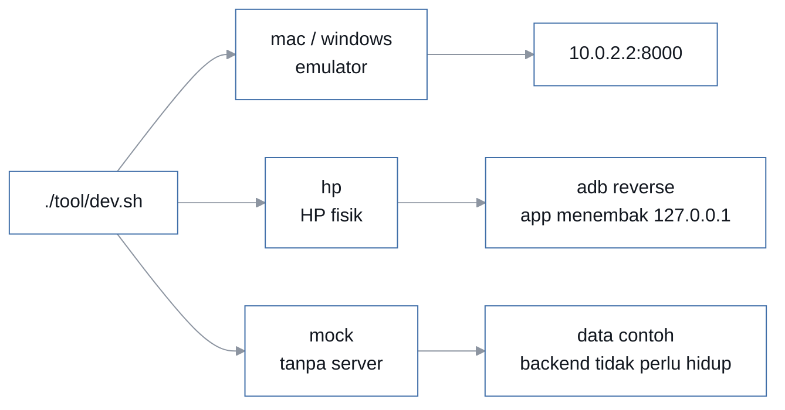
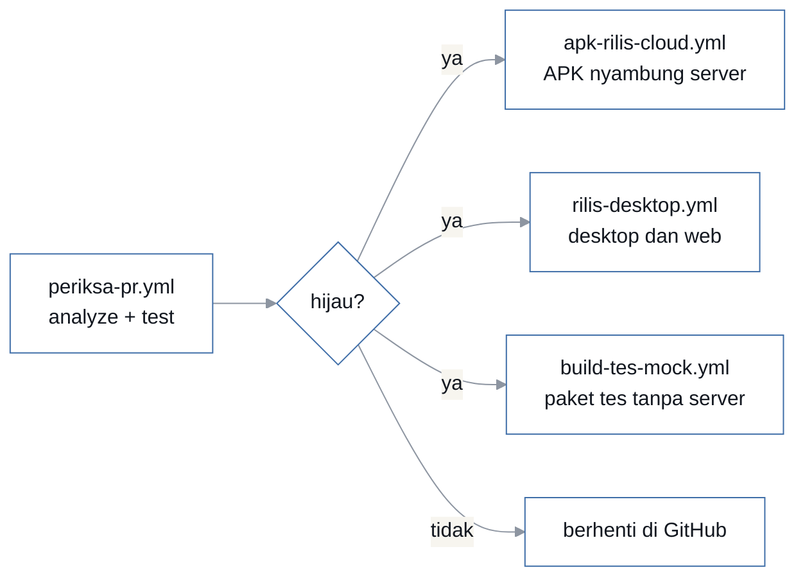

<p align="center">
  
</p>

<p align="center">
  <a href="../../actions/workflows/periksa-pr.yml"></a>
  
  
  
  <a href="https://sidik-kalibrasi.web.app"></a>
</p>

Aplikasi mobile satu APK untuk kalibrasi alat ukur dan sertifikat digital PT Sidik.
Teknisi dan admin memakai aplikasi yang sama, dibedakan lewat role. Backendnya repo
terpisah [`sidik-calibration-api`](https://github.com/ZainulArkaanAlinsi/sidik-calibration-api)
(Laravel + Filament). Dikembangkan selama program magang di PT Sidik, dikerjakan berdua.

Yang dikerjakan aplikasi ini bukan sekadar form: teknisi memotret **lembar kerja kertas**
di lokasi, OCR membacanya di perangkat, lalu manusia wajib meninjau hasilnya sebelum satu
angka pun tersimpan. Sel yang keyakinannya tidak diketahui pengenal teks diperlakukan
sebagai **belum terisi**, bukan sebagai "kemungkinan benar" — karena angka yang meleset
satu digit membatalkan seluruh sertifikat.

| Komponen | Detail |
| --- | --- |
| Framework | Flutter **3.44.6** (dipatok CI lewat `FLUTTER_VERSION`), Dart SDK `^3.11.5` |
| State management | Riverpod 3 (`flutter_riverpod ^3.3.2`) — alasannya di [Keputusan teknis](#keputusan-teknis) |
| OCR | `google_mlkit_text_recognition` + `google_mlkit_barcode_scanning`, **jalan di perangkat** |
| Backend | Laravel, lewat token Sanctum |
| Sebaran | Android via Firebase App Distribution, desktop dan web via Firebase Hosting |

## Cara kerjanya di lapangan

Tiga layar di gambar atas adalah alurnya, dan yang paling menentukan justru layar kedua.
Hasil pindai **tidak pernah langsung tersimpan**: tombol lanjut mati selama masih ada sel
kosong, termasuk sel yang dikotaki amber karena ML Kit tidak memberi tahu keyakinannya.

Bedanya penting dan sengaja: `null` pada `keyakinan` berarti **tidak diketahui**, bukan
"yakin" dan bukan "tidak yakin". ML Kit menyetel `confidence` per elemen hanya di sebagian
versi dan perangkat. Sel yang keyakinannya tidak diketahui tidak boleh dinaikkan jadi
"aman" — lihat `lib/services/pembaca_halaman.dart`.

Input manual selalu tersedia sebagai jalur penuh, bukan cadangan darurat. Manual dan hasil
pindai masuk lewat pipeline yang sama, jadi tidak ada jalur kedua yang diam-diam berbeda
perilakunya.

## Setup

```bash
git clone https://github.com/ZainulArkaanAlinsi/sidik-calibration-mobile.git
cd sidik-calibration-mobile
flutter pub get
./tool/dev.sh mac      # atau: windows · hp · mock
```

Pastikan `flutter doctor` bersih sebelum run pertama.

Menyiapkan mesin kedua supaya isinya sama persis — termasuk versi Flutter yang dipatok CI
dan berkas yang tidak ikut git: [`docs/sinkron-laptop-windows.md`](docs/sinkron-laptop-windows.md).
Untuk membuktikan dua mesin sudah sama: `./tool/cek-sinkron.sh`.

Prompt terminal yang menunjukkan branch, kerjaan yang belum di-commit, dan versi Flutter
yang benar-benar aktif: `./tool/pasang-terminal.sh` (Windows: `.\tool\pasang-terminal.ps1`).
Lihat [`docs/terminal-cantik.md`](docs/terminal-cantik.md).

### Konfigurasi environment

Tidak ada URL yang ditanam di kode. Semuanya lewat `--dart-define`, lihat
`lib/core/config/app_config.dart`:

| Key | Default | Keterangan |
| --- | --- | --- |
| `APP_ENV` | `dev` | `dev` / `staging` / `prod` |
| `API_BASE_URL` | `http://10.0.2.2:8000/api` | `10.0.2.2` = localhost laptop dilihat dari emulator Android |



> [!IMPORTANT]
> Untuk HP fisik, **jangan isi IP LAN laptop.** Nilai itu berubah tiap pindah wifi dan
> harus didaftarkan lagi di `network_security_config.xml`; kalau tidak, Android menolak
> requestnya dengan `CLEARTEXT_NOT_PERMITTED` — error yang menyamar jadi "backend mati".
> `./tool/dev.sh hp` menghindari IP sama sekali: `adb reverse` membuat port di HP menembus
> ke laptop, jadi app menembak `127.0.0.1` — alamat yang tidak mungkin basi, dan jalan
> lewat USB tanpa wifi. Skrip itu menolak jalan kalau backendnya belum hidup.

Supaya URL-nya berhenti berubah sama sekali: [`docs/tunnel-cloudflare.md`](docs/tunnel-cloudflare.md).

## Perintah harian

```bash
flutter analyze      # wajib bersih sebelum commit
flutter test         # 193 berkas test
./tool/dev.sh mac    # mac | windows | hp | mock
```

## Struktur

```
lib/                    271 berkas dart
├── main.dart           entrypoint: ProviderScope + SidikApp
├── app.dart            MaterialApp (tema + halaman awal)
├── core/               18   AppConfig, identitas lab, konstanta
├── models/             38
├── services/           70   api, auth, kamera, pembaca halaman OCR
├── providers/          37   Riverpod
├── screens/            67   tersebar di 18 folder fitur
└── widgets/            36   komponen reusable
```

## Testing dan CI



Golden test dijalankan di macOS lewat workflow terpisah `golden-baru.yml`: hasil render
berbeda antar sistem operasi, jadi baseline yang dibuat di Windows akan merah di CI tanpa
ada yang benar-benar rusak.

## Membagikan aplikasi

Halaman unduh: **<https://sidik-kalibrasi.web.app>** — tiga tombol, Android / macOS /
Windows. Untuk memasang di HP teknisi, Mac, dan PC tanpa laptop developer, lihat
[`docs/deploy-firebase.md`](docs/deploy-firebase.md).

## Keputusan teknis

**Riverpod, bukan Provider / Bloc / GetX.**

`package:provider` bergantung pada `BuildContext`, dan itu merepotkan di service layer serta
alur OCR yang penuh async. Bloc terlalu banyak boilerplate untuk tim dua orang dengan
tenggat dua sampai tiga bulan. Riverpod compile-safe, gampang di-override waktu test (lihat
`test/widget_test.dart`), dan `AsyncValue`-nya cocok untuk state loading/error dari API dan
kamera — dua hal yang paling banyak dipakai aplikasi ini.

## Prinsip desain

Bottom nav sama untuk semua role; yang berbeda hanya isi tab **Profil**, dan menu admin
disembunyikan total dari non-admin, bukan sekadar dinonaktifkan. Hasil pindai wajib
direview sebelum tersimpan. Input manual selalu tersedia. UI memakai design system sejak
awal, karena targetnya aplikasi ini mungkin ditawarkan ke perusahaan lain.

## Alur kerja

Branch `main` untuk rilis; pekerjaan lewat `feature/nama-fitur` dan `chore/nama`. Commit
memakai [Conventional Commits](https://www.conventionalcommits.org/). `flutter analyze`
wajib bersih sebelum commit.

> [!CAUTION]
> **Repo ini publik.** Jangan pernah menulis kredensial, token, atau data pelanggan asli di
> berkas yang ikut git — termasuk di tangkapan layar dan berkas contoh. Riwayat git tidak
> ikut bersih waktu sebuah berkas dihapus.

## Tampilan README ini

Gambarnya satu berkas: [`.github/assets/readme.svg`](.github/assets/readme.svg). Paletnya
terkumpul di satu blok komentar di kepala berkas — ganti warna di situ saja, tidak perlu
menyisir isinya. Palet itu sengaja dibuat kembar dengan repo API supaya dua repo satu
proyek terlihat sekeluarga.

Animasinya hiasan semua, dan itu aturan yang ditegakkan: tidak ada satu pun teks atau angka
yang baru terlihat karena animasi, supaya isinya tidak bisa hilang kalau animasinya tidak
dijalankan.
